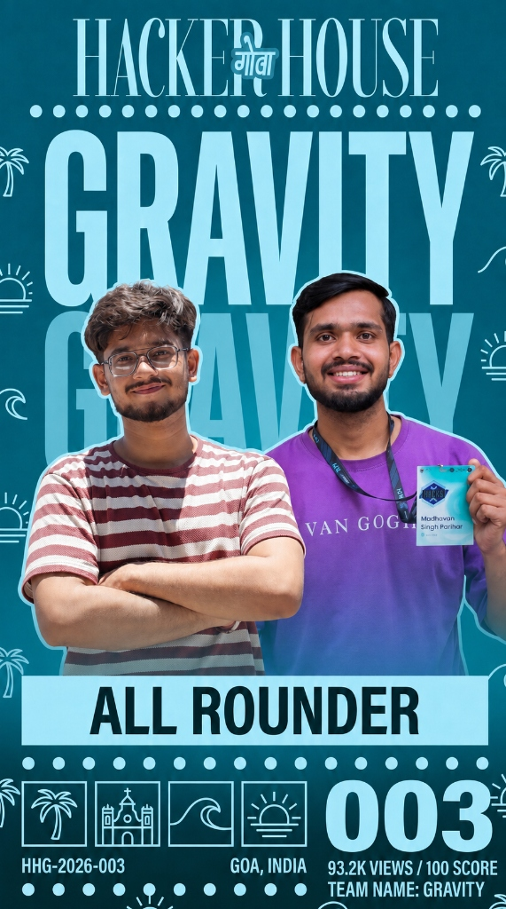

<div align="center">

# **3rd Place  — Hacker House Goa 2026 (Task1 Leaderboard)**
# **Team Gravity**



[](https://github.com/madhavansingh/hhgoa-builder-card)
[](https://github.com/madhavansingh/hhgoa-builder-card)
[](https://github.com/madhavansingh/hhgoa-builder-card)
[](https://react.dev/)
[](https://vitejs.dev/)

<p align="center">
  <b>Generate your official, personalized Hacker House Goa 2026 Builder Card in seconds.</b><br>
  Packed with Goa beach vibes, real-time photo positioning, dynamic builder classes, and one-click high-res export.
</p>

[Explore Live Experience](#-local-setup) • [Leaderboard Showcase](#-team-gravity--leaderboard-showcase) • [Features](#-key-features) • [Tech Stack](#-tech-stack)

</div>

---

## 🏆 Team Gravity — Leaderboard Showcase

> **"Build in Goa, Ship from Paradise"**

At **Hacker House Goa 2026**, **Team Gravity** secured **3rd Place** on the official leaderboard with our interactive builder platform!

| Metric | Detail |
| :--- | :--- |
| 👥 **Team Name** | **Team Gravity** |
| 🪪 **Pass ID** | `HHG-2026-003` |
| 🌟 **Designation** | **All Rounder** |
| 📊 **Leaderboard Impact** | **93.2K Views / 100 Score** |
| 📍 **Location** | Goa, India (Hacker House Goa) |

---

## ✨ Key Features

### 🎬 Interactive Cinematic Landing Experience
- **Dynamic Dithering Shader Background**: High-performance GPU-rendered wave shader built with `@paper-design/shaders-react` and Three.js.
- **Ambient Glow Orbs**: Subtle breathing gradient lighting tailored with Goan greens (`#026834`) and sunny yellows (`#FEE101`).
- **Hype Video Trailer**: Built-in 2:47 PM Studio pre-hype video modal with custom controls and escape key navigation.
- **Initial Preloader**: Atmospheric entrance animation with custom typography and brand mark.

### 🪪 Builder Pass Generator
- **Photo Upload & Precision Framing**:
  - Drag-and-drop or file selector supporting PNG, JPG, WEBP, and HEIC.
  - Interactive circular mask preview with real-time drag positioning and zoom slider.
- **Dynamic Builder Classes & Stickers**:
  - Unique badges assigned dynamically (from *Cache Raider* and *Terminal Surfer* to *Wave Rider* and *Night Champion*).
- **Goa Beach Bag Essentials**:
  - Curated builder gear combinations stamped directly on the pass (e.g., *Coffee & VS Code*, *Feni & Rust*).
- **Smart QR Code Generation**:
  - Embedded unique verification QR code generated client-side via `qrcode.react`.
- **Auto Builder Randomizer**:
  - Instant one-click random persona generation for rapid testing and inspiration.

### 🚀 Instant Export & Social Sharing
- **Pixel-Perfect High-Res PNG Export**: Client-side render to PNG powered by `html-to-image`.
- **Direct Share to X (Twitter)**: Pre-composed post with customized copy, builder stats, and official hashtags (`#FrameInGoa`, `#HHGoa2026`).

### 📱 100% Mobile & Desktop Responsive
- Fully fluid typography (`clamp`) and tailored media queries ensure seamless experiences across smartphones (from 320px screens to ultra-wide desktop monitors).

---

## 🛠️ Tech Stack

| Technology | Purpose |
| :--- | :--- |
| **React 19** | Core component framework |
| **Vite 6** | Ultra-fast bundling, HMR, and build pipeline |
| **Three.js** | WebGL runtime for background rendering |
| **@paper-design/shaders-react** | Custom GPU dithering wave shader |
| **html-to-image** | Client-side DOM-to-PNG canvas rendering |
| **qrcode.react** | Dynamic SVG & Canvas QR code generation |
| **Lucide React** | Modern iconography set |
| **Vanilla CSS3** | Custom design system with CSS custom properties |

---

## 📂 Project Structure

```text
hhgoa-builder-card/
├── public/
│   ├── assets/
│   │   ├── 2-47.svg                       # 2:47 PM Studio official logo
│   │   ├── BuilderPass.png                # Pass template canvas artwork
│   │   ├── Hacker house.png               # Brand badge
│   │   ├── Prehype.mp4                    # Hype trailer video
│   │   └── team-gravity-leaderboard.jpg   # Team Gravity Leaderboard Showcase
│   ├── stickers/                          # Collectible builder class stickers
│   ├── favicon.png
│   ├── idCardTemplate.png
│   └── logo-background-remove.png
├── src/
│   ├── components/
│   │   ├── landing/                       # Landing Page Experience
│   │   │   ├── DitheringBackground.jsx    # Three.js / shader canvas
│   │   │   ├── Header.jsx                 # Nav with CHECK HYPE & CREATE
│   │   │   ├── HeroSection.jsx            # Typography & event dates
│   │   │   ├── HypeVideoModal.jsx         # Video overlay modal
│   │   │   ├── InitialPreloader.jsx       # Loading sequence
│   │   │   ├── Footer.jsx                 # Brand footer
│   │   │   └── landing.css                # Responsive landing styles
│   │   ├── CardGenerator.jsx              # Main builder workflow state
│   │   ├── HHGoaCard.jsx                  # Visual pass DOM layout
│   │   ├── UploadPhoto.jsx                # Photo repositioning & zoom
│   │   ├── UserForm.jsx                   # Builder details input form
│   │   ├── QRCode.jsx                     # Dynamic QR generator
│   │   ├── DownloadButton.jsx             # PNG image generator
│   │   └── ShareButton.jsx                # Direct social share to X
│   ├── utils/
│   │   └── randomGenerator.js             # Traits, classes & beach essentials
│   ├── App.jsx                            # Root view switcher
│   ├── App.css                            # Generator view layout & headers
│   └── main.jsx                           # Application entry point
├── package.json
└── vite.config.js
```

---

## 🚀 Local Setup

Run the project locally in three steps:

1. **Clone the repository:**
   ```bash
   git clone https://github.com/madhavansingh/hhgoa-builder-card.git
   cd hhgoa-builder-card
   ```

2. **Install dependencies:**
   ```bash
   npm install
   ```

3. **Start the local development server:**
   ```bash
   npm run dev
   ```

4. Open your browser and navigate to:
   ```text
   http://localhost:5173
   ```

---

## 👥 Team Gravity

- **Madhavan Singh Parihar** ([@madhavansingh](https://github.com/madhavansingh))
- **Kanishq Singh Negi** ([@KANISHQ09](https://github.com/KANISHQ09))

Built for **Hacker House Goa 2026** 🌊🌴
